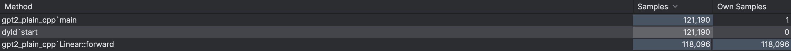

# GPT-2 inference in Plain C++
This project is a simple implementation of
OpenAI’s GPT-2 (124M parameters) language model inference written entirely 
in plain C++ for CPU (unfortunately I don't have any GPU). The main goal is to create a 
self-contained GPT-2 inference engine without 
relying on external libraries or dependencies. 
By building everything from scratch, I want to gain a 
deeper understanding of how LLMs works and have 
full control over performance optimizations. The initial focus is on correctness 
and simplicity. Performance optimizations will be 
introduced incrementally, aiming to enhance 
inference speed and efficiency.

## Getting Started

### Requirements

- **C++ compiler:** A compiler that supports C++17 or higher (e.g., GCC, Clang, MSVC).
- **CMake:** Version 3.15 or higher for building the project.
- **Python3 with Pytorch installed:** For running the conversion script to prepare model weights.
- **OpenMP (Optional):** for running inference on multiple threads

### Preparing the Model Weights and Vocabulary

Obtain the GPT-2 model weights (pytorch_model.bin) from [Hugging Face](https://huggingface.co/openai-community/gpt2/tree/main).
The C++ code expects the model weights in a specific binary
format. Use the provided [export_weights.py](export_weights.py) script
to convert the pytorch_model.bin file into a binary file containing all weights serialized as 32-bit floats:
```console
python export_weights.py <output_filepath> <pytorch_model.bin_filepath>
``` 

Then you also need to download [vocab.json](https://huggingface.co/openai-community/gpt2/blob/main/vocab.json)
from the same Hugging Face repo.

### Build

```console
mkdir build
cd build
cmake -DCMAKE_BUILD_TYPE=Release ..
make
``` 
or if you want to compile with openMP:
```console
cmake -DCMAKE_BUILD_TYPE=Release -DWITH_OPENMP=1 ..
``` 

### Running the inference

After building the executable, try an example:
```console
./gpt2_plain_cpp <model_weights_path> <vocab_json_path> -p "I'm learning deep nueral networks" -n 20
```

The following options are supported:
```
Required:
[model_weights_path] -- path to .bin file generated with export_weights.py script
[vocab_json_path] -- path to vocab.json for GPT2
Optional:
[-p <std::string>] prompt to start generation with
[-n <int>] number of tokens to generate
[-s <int>] seed if you want to reproduce the result
[-t <int>] number of threads (default: 1)
```

## Optimization path

Here I will try to describe all performance optimizations 
I made so far. Our main metrics will be Time To First Token (TTFT) and
Time Per Output Token (TPOT) and Total generation time (TTFT + TPOT x number of generated tokens).

My hardware: **MacBook Pro (M2, 2023)** 

|                | TTFT (50 tokens promt) | TPOT (200 tokens in total) | Total generation time |
|----------------|------------------------|----------------------------|-----------------------|
| Optimization 0 | 7900 ms                | 155 ms                     | 38.9 s                |
| Optimization 1 | 614.8 ms               | 12.3 ms                    | 3.1 s                 |
| Optimization 2 | 322.19 ms              | 7.2 ms                     | 1.7 s                 |

### 0. No optimizations

Initially I implemented very naive inference without any optimizations (except KV-cache).


### 1. Cache-friendly implementation of Linear::forward
Let's profile our code to find a hot path:

As we can see, the program spends the majority of its time (97.5%) in the *forward* function of the *Linear* layer, 
which actually is quite obvious. We can observe that the current implementation
is not cache-friendly. Since the weight matrices are row-continuous, the memory access pattern is non-sequential.
To address this, we can simply swap the inner and outer loops (see the
corresponding [commit](https://github.com/SomovMike/gpt2_plain_cpp/commit/f355a7e33eddce5deff16828b94f94c2bb303329)).
The first optimization is the easiest,
but at the same time bringing the most significant performance improvement (12.5x!).

### 2. Add multithreading

We still have room for improvement in the forward function in the Linear layer.
Currently, we are using only a single thread, so adding multithreading
to the Linear::forward function could help, as this is still
a hot path for inference. First, we need to transpose the
weight matrices of all linear layers to make them
column-continuous, then swap the inner and outer loops.
This adjustment maintains sequential memory access while enabling
more effective parallelism, as each thread can process
its own batch of output channels. (see the
corresponding [commit](https://github.com/SomovMike/gpt2_plain_cpp/commit/9e5b65df9b91c7492b205447adf5105a410eceee)) This optimization brings almost
a twofold performance improvement with 8 threads enabled.
For larger models, the improvement should be even more
significant, as the multithreading overhead is relatively
high compared to the number of calculations in our
forward function.


## Acknowledgments

- **[Andrej Karpathy](https://github.com/karpathy)**
- **[Georgi Gerganov](https://github.com/ggerganov)** 
- **[Simon Boehm](https://siboehm.com/)**


